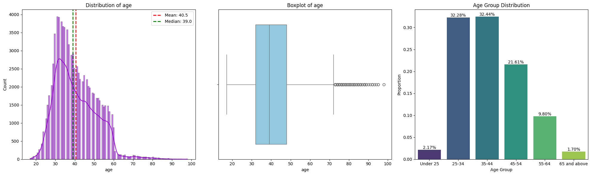

# Cracking the Code: How Machine Learning Transforms Bank Marketing Strategies


## **Project Overview**
This project leverages machine learning to enhance the effectiveness of **direct marketing campaigns** in the banking sector. The objective is to predict the likelihood of a customer subscribing to a **term deposit**, uncover insights into customer behavior, and optimize marketing strategies. The final deliverable is an interactive and scalable predictive model integrated into a **Streamlit** application.

  


## **Key Features**
### 1. Predictive Insights:
The project predicts **subscription likelihood** based on:
- **Customer Demographics**: Age, job type, marital status, education, and financial history.
- **Financial Details**: Average yearly balance and loan status.
- **Campaign Interactions**: Type and duration of contact, frequency of interactions, and outcomes of previous campaigns.
- **Temporal Patterns**: Seasonal trends derived from day, month, and year.
- **Economic Indicators**: Broader influences like employment rates, confidence indices, and interest rates.

### 2. Hypothesis Testing:
The project tests the influence of an **Economic Sentiment Index (ESI)** on subscription likelihood:
- **H₀**: ESI has no significant effect on subscription likelihood.
- **H₁**: ESI significantly affects subscription likelihood and varies over time.


## **Key Questions**
The analysis is structured around answering the following:
- What demographic or financial traits correlate with term deposit subscriptions?
- How do campaign-specific features like **contact duration** or **poutcome** influence outcomes?
- What temporal and economic trends impact customer decisions?


## **Data Exploration and Visualizations**
### **Exploratory Data Analysis (EDA)**
The project employs:
- **Univariate Analysis**: Distribution plots for individual features.
- **Bivariate and Multivariate Analysis**: Heatmaps, pair plots, and bar charts.

**Examples of Visualizations**:
1. **Age Distribution**:
   Grouped into age categories and visualized against subscription likelihood.
   

2. **Economic Indicators by Month**:
   Trends observed across indicators like `emp.var.rate` and `euribor3m`.

3. **Poutcome Analysis**:
   Insights into how previous outcomes (`poutcome`) affect subscription rates.

---

## **Machine Learning Approach**
### **Steps**:
1. **Feature Engineering**:
   - Encoding categorical variables.
   - Creating new features like `Economic Sentiment Index`.

2. **Model Development**:
   - Baseline models implemented: Logistic Regression, Random Forest, XGBoost, and Neural Networks.
   - Evaluation metrics: Accuracy (>85%), F1 Score (>80%), and ROC-AUC (>80%).

3. **Hyperparameter Tuning**:
   - Conducted for models exceeding baseline F1 expectations.

4. **Deployment**:
   - Developed a **Streamlit dashboard** for real-time prediction and insights.
   - Containerized using **Docker** for seamless deployment.

---

## **Interactive Tool**
### Features of the Streamlit App:
- **Real-Time Predictions**:
  - Users can input customer details to predict term deposit subscription likelihood.
- **Visual Insights**:
  - Interactive dashboards visualize customer demographics, financial details, and campaign outcomes.
- **Customizable Analysis**:
  - Filters for demographics, economic indicators, and temporal features.

---

## **Reproducibility**
### Workflow:
1. **Environment Setup**:
   - Create a reproducible Python environment using Docker and `requirements.txt`.
2. **Data Preparation**:
   - Handle missing values, duplicates, and feature transformations.
3. **Model Training**:
   - Scripts for training, tuning, and evaluating machine learning models.
4. **Deployment**:
   - Step-by-step deployment protocol using Docker for production-ready applications.

---

## **Key Insights**
### From the Analysis:
- **Subscription Likelihood**:
  - `Success` in previous campaigns is the strongest predictor of subscription.
  - Customers under 25 and above 65 are more likely to subscribe.
- **Economic Influence**:
  - Higher employment rates and lower interest rates positively influence subscriptions.
- **Campaign Impact**:
  - Longer call durations are highly correlated with successful subscriptions.

---

## **How to Use**
1. **Clone the Repository**:
   ```bash
   git clone https://github.com/username/bank_term_deposit_analysis.git
   cd bank_term_deposit_analysis
   ```
2. **Run the Streamlit App**:
   ```bash
   streamlit run app.py
   ```
3. **Visualize and Predict**:
   - Use the app to explore customer data, visualize trends, and predict subscription likelihood.

---

## **Acknowledgements**
This project draws from industry-standard datasets and incorporates machine learning best practices to empower banks with actionable insights for improving marketing efficiency.

For additional details, refer to the full **[project documentation](docs/project_report.pdf)** or the **Streamlit App User Guide** included in the repository.